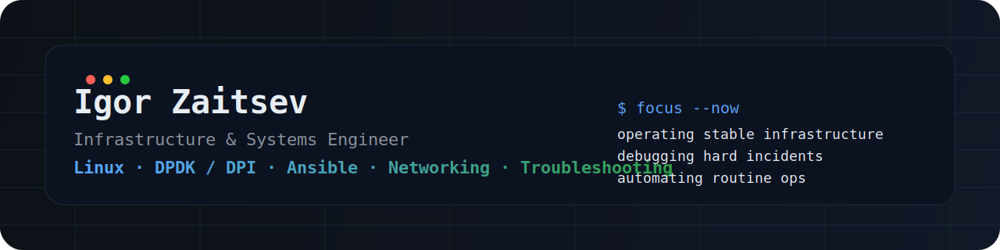

  

<h1 align="center">Igor Zaitsev</h1>

  Infrastructure & Systems Engineer · Linux · DPDK / DPI · Ansible · Networking · Troubleshooting

  
  
  

---

## About me

I am an Infrastructure & Systems Engineer focused on Linux operations, high-performance networking, deployment automation, and deep troubleshooting across the chain of **network → OS → service → configuration**.

My main interest is building and operating stable infrastructure: diagnosing incidents, supporting DPI/DPDK-based environments, automating routine work, and improving observability. Security is an important adjacent domain for me, but my core profile is infrastructure, systems operations, and troubleshooting.

---

## What I work with

### Infrastructure / Systems

- Linux server administration and service diagnostics
- Operations of infrastructure services and virtualized environments
- System logs, service lifecycle, host-level troubleshooting

### Networking / DPI / DPDK

- DPI server operations and incident analysis
- NIC ↔ PCI mapping, VFIO binding, port and link diagnostics
- Linux host preparation for network load: CPU pinning, core isolation, baseline performance tuning

### Automation / Observability

- Idempotent deployments and config support with Ansible
- Python and Bash for operational automation
- Monitoring, alerting, and service state analysis with Prometheus and Grafana

### Security as a supporting domain

- Vulnerability analysis and infrastructure security fundamentals
- Hands-on work with Kali Linux, Nmap, and GVM
- Understanding of alerts, incident flow, and security as part of production operations

---

## Current focus

- Operating Linux-based infrastructure and network services
- Supporting DPI/DPDK environments and troubleshooting launch/runtime issues
- Automating deployment and configuration workflows with Ansible
- Improving observability and incident response through metrics and alerting
- Researching runtime protection approaches for mobile banking applications

---

## Experience

### Infrastructure & Troubleshooting Engineer
**7Generation** · Aug 2025 — Present

- Operating and supporting server infrastructure
- Maintaining and monitoring DPI servers, including DPDK-related host/network setup
- Troubleshooting incidents across network, OS, services, and configuration layers
- Automating routine operational tasks with Ansible, Bash, and Python

### Information Security Engineering Intern
**Kazakhstan Housing Company** · Jun 2025 — Jul 2025

- Worked with SOC and DLP-related workflows: alerts, classification, and reporting
- Built and integrated a Docker-based log forwarding component
- Worked with document watermarking and data leakage prevention practices
- Studied and applied ISO/IEC 27001 and 27002 aligned practices

---

## Selected work areas

Instead of publishing internal repositories or NDA-bound material, I use GitHub to reflect my engineering direction and practical domains:

- Linux infrastructure operations
- Network troubleshooting playbooks and notes
- DPDK / DPI lab knowledge
- Automation patterns with Ansible and scripting
- Monitoring and alerting examples
- Security research and applied lab work

---

## Education

**Astana IT University**  
BSc in Cybersecurity · 2023 — 2026

- Protection of network infrastructure from cyber threats
- Configuration of routers, switches, and firewalls
- Penetration testing and security assessment practices

---

## Ongoing research

### Dynamic Runtime Protection for Mobile Banking
Research project focused on runtime behavioral protection for mobile banking applications using syscall interception, malicious activity detection, and prototype defensive logic.

---

## Contact

- Email: **id.zaitsev@gmail.com**
- Resume: **resume.zaitsev.workers.dev**
- GitHub: **github.com/InKO0505**

---

  <i>Focused on stable systems, clean operations, and solving hard infrastructure problems.</i>

